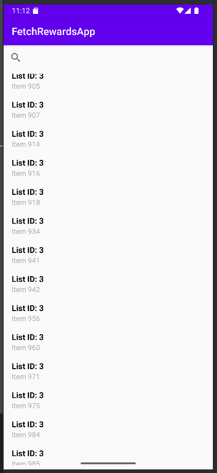
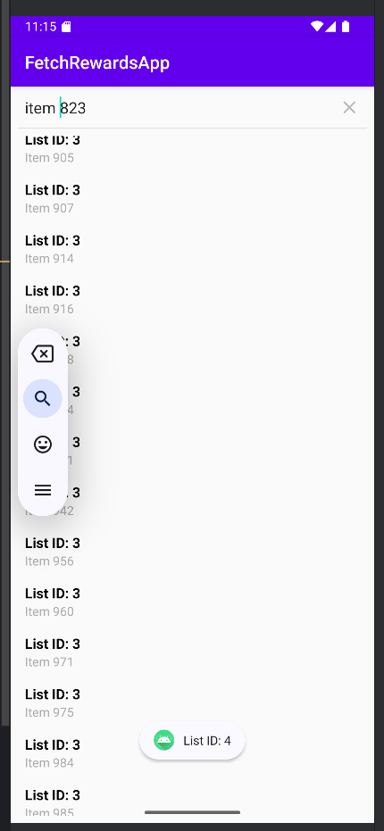

# Fetch Rewards Coding Challenge - Android App

This is a lightweight Android application developed using Kotlin, MVVM architecture, Retrofit, and RecyclerView.
The app fetches data from a given API, processes it, displays it in a sorted and grouped list, and provides a search bar that allows users to find items based on their names or numeric values.

### Demonstration Screenshots:
Below are the four demonstration images showcasing the app's functionality:

Sort:


Search:


## Features
- Fetches JSON data from the API using Retrofit
- Displays items in a RecyclerView, grouped and sorted
- Filters out items where name is null or empty
- Sorting rules:
  - First by `listId`
  - Then by `name` (numbers are sorted numerically, not lexically)
- Search functionality:
  - Supports exact name search (e.g., `"Item 823"`)
  - Supports number-only search (e.g., `"823"` finds `"Item 823"`)
  - Case-insensitive search

## API Used
The app retrieves data from the following API:

**URL:** `https://fetch-hiring.s3.amazonaws.com/hiring.json`

## Project Structure

### Source Code Directory
```bash
app/src/main/java/com/example/fetchrewardsapp/
├── adapter/
│   ├── ItemAdapter.kt          # RecyclerView Adapter
│
├── model/
│   ├── Item.kt                 # Data Model for JSON response
│
├── network/
│   ├── ApiService.kt           # Retrofit API Interface
│   ├── RetrofitClient.kt       # Retrofit Instance
│
├── view/
│   ├── MainActivity.kt         # Main UI
│
├── viewmodel/
│   ├── ItemViewModel.kt        # ViewModel with LiveData
```

### Layout and UI Resources
```bash
app/src/main/res/layout/
├── activity_main.xml           # Main Layout (Toolbar, SearchView, RecyclerView)
├── item_layout.xml             # Layout for each RecyclerView item
```

### App Resources
```bash
app/src/main/res/values/
├── colors.xml                  # App Theme Colors
├── strings.xml                 # App Strings
├── themes.xml                  # App Theme Styles
```

## Setup & Installation

### Clone the repository
```sh
git clone https://github.com/your-github-username/fetch-rewards-app.git
cd fetch-rewards-app
```

### Open in Android Studio
1. Open Android Studio  
2. Click **File > Open** and select the cloned project folder  
3. Wait for Gradle to sync dependencies  

### Run the App
1. Connect an emulator or a real device  
2. Click **Run** in Android Studio  

## Feature 1:
Retrieve and parse the `data` link, then filter out entries where `name` is null or empty.
Sort the list first by `listId`, then numerically by `name`.

### Optimization:
- **Fetch data using Retrofit** (Retrofit is an automated HTTP request tool that simplifies API calls).
- **Retrofit Configuration**: The `baseUrl(DATA_URL)` transmits the link and sends a `GET` request, using `Gson` to parse the returned JSON file and automatically generate a predefined `List<Item>` object.
- In `ItemViewModel.kt`, Kotlin's concise syntax allows filtering out empty data and performing dual sorting in just three lines:

```kotlin
.filter { it.name?.isNotBlank() == true } // Filter out entries where name is null or empty
.sortedWith(compareBy<Item> { it.listId } // Sort first by listId
    .thenBy { it.name?.filter { it.isDigit() }?.toIntOrNull() ?: Int.MAX_VALUE }) // Then sort numerically by name
```

- **Finally, `ItemAdapter.kt` manages the data and constructs the view**.

### Key Optimizations:
- *The lazy block executes only when `apiService.getItems()` is called, optimizing resource usage.*
- *The `suspend` function in `ApiService.kt` prevents blocking the main (UI) thread, ensuring smooth application performance.*


## Feature 2: Search Items by Name or Number
Users can search for items in multiple ways:
1. Exact name search → `"Item 823"` finds `Item 823`
2. Number-only search → `"823"` also finds `Item 823`
3. Case-insensitive search → `"item 823"` finds `Item 823`

#### Implemented in `searchItem()`

## Dependencies
The project uses the following additional dependencies in `build.gradle.kts`:
```kotlin
dependencies {
    // MVVM & LiveData
    implementation("androidx.lifecycle:lifecycle-viewmodel-ktx:2.6.2")
    implementation("androidx.lifecycle:lifecycle-livedata-ktx:2.6.2")
    // Network Requests (Retrofit & Gson)
    implementation("com.squareup.retrofit2:retrofit:2.9.0")
    implementation("com.squareup.retrofit2:converter-gson:2.9.0")
    // UI Components (RecyclerView)
    implementation("androidx.recyclerview:recyclerview:1.4.0")
}
```

## License
This project is licensed under the MIT License.
